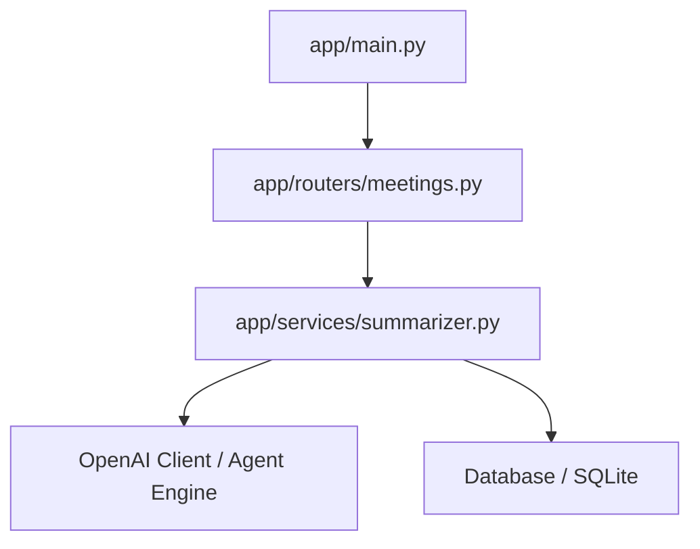

# 프로젝트 컨텍스트 맵 (Project Context Map)

## 1. 핵심 의존성 다이어그램

* 프로젝트의 폴더 및 주요 파일 간의 구조적 결합도와 데이터 흐름을 시각적으로 나타냅니다. (Mermaid 다이어그램 권장)

## 2. 작업 중인 컨텍스트 (Active Context)

* 현재 이터레이션에서 실질적으로 생성하거나 변경해야 할 핵심 타겟 파일 목록을 정리하여, Claude가 불필요한 외곽 파일을 열거나 꼬이지 않도록 제한합니다.

1. `app/services/summarizer.py` (핵심 LLM 요약 호출 로직 담당)
2. `app/routers/meetings.py` (요약 요청 API 엔드포인트 정의)
3. `tests/test_summarizer.py` (자동화 단위 테스트 작성 및 회귀 방지용 테스트)

## 3. 핵심 아키텍처 및 비즈니스 제약 사항

* 구현 시 반드시 지켜야 하는 라이브러리 스택 규칙, 코딩 관행 및 비즈니스 예외 규칙을 정의합니다.

- **비동기 모델 규칙**: 모든 외부 API 호출(LLM 호출 및 DB 쓰기)은 `async`/`await` 패턴을 필수적으로 준수해야 합니다.
- **예외 처리 제약**: OpenAI API 호출 시 발생하는 `RateLimitError` 및 `AuthenticationError`는 커스텀 HTTP Exception으로 잡아내어 400 및 401 코드로 에러를 반환해야 합니다.
- **인증 토큰 규칙**: API 호출 시 Authorization Header로 들어오는 JWT 토큰을 사전에 검증하여 무효한 사용자는 차단해야 합니다.

